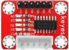
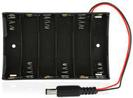
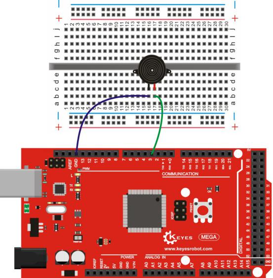
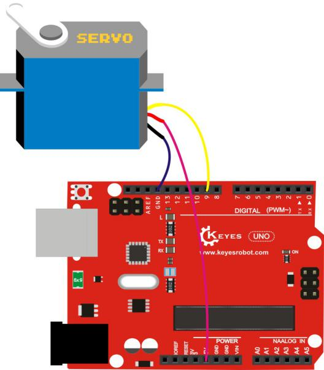
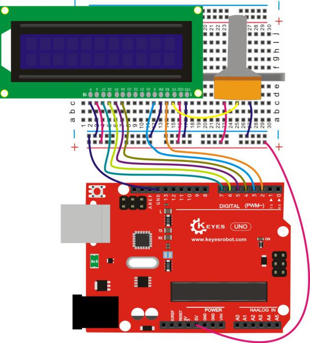
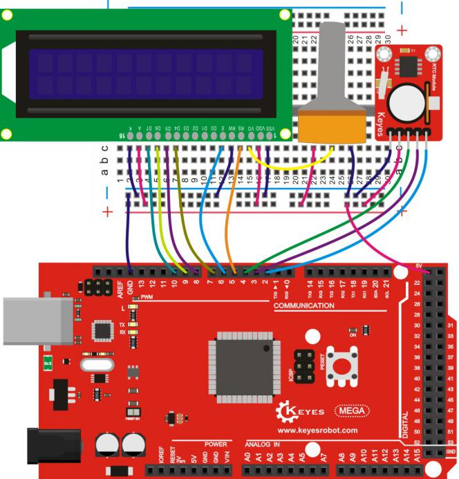

Keyes 超级版学习套件 for Arduino


# 产品介绍

Keyes
超级版学习套件包含我们学习Arduino 单片机常用到的传感器模块、元器件和Arduino控制板。同时我们还会根据这些元器件和传感器模块，提供一些基Arduino控制板的学习课程，课程包含了接线方法、测试代码、实验结果等信息，它让你对这些元器件、传感器模块和Arduino控制板有个初步的了解。

# 清单


|编码|名称|规格型号|数量|图片|
|-|-|-|-|-|
|1|遥控器|JMP-1 17键86*40*6.5MM 黑色|1||
|2|keyes传感器|keyes 人体红外热释电传感器|1||
|3|keyes传感器|keyes 1302时钟传感器|1||
|4|keyes传感器|keyes 超声波传感器|1||
|5|keyes传感器|keyes 摇杆模块传感器(焊盘孔) 红色 环保|1||
|6|keyes模块|keyes 5V 单路继电器模块(焊盘孔) 红色 环保|1||
|7|keyes传感器|Keyes Steam Seneor 水滴水蒸气传感器|1||
|8|keyes传感器|keyes 麦克风声音传感器(焊盘孔) 红色 环保|1||
|9|keyes传感器|keyes DHT11温湿度传感器(焊盘孔) 红色 环保|1||
|10|keyes驱动板|Keyes ULN2003步进电机驱动板（焊盘孔） 红色 环保|1||
|11|keyes传感器|keyes 9930 接近和非接触式手势检测RGB和姿态传感器|1||
|12|keyes传感器|Keyes Vibration Seneor 震动检测传感器|1||
|13|模块|5V步进电机|1||
|14|舵机|SG90 9G 23*12.2*29mm 蓝色 辉盛(环保）|1||
|15|LCD|1602 COB 5V 蓝屏|1||
|16|蜂鸣器|无源 12*8.5MM 5V 普通分体 2K|1||
|17|蜂鸣器|有源 12*9.5MM 5V 普通分体 2300Hz|1||
|18|轻触按键|12*12*5MM 插件|10||
|19|轻触按键|6*6*5MM 插件|4||
|20|传感器元件|LM35DZ|1||
|21|传感器元件|5MM 光敏电阻|3||
|22|传感器元件|红外接收 5MM火焰|1||
|23|传感器元件|红外接收 VS1838B|1||
|24|滚珠开关|HDX-2801 两脚一样|2||
|25|LED|F5-白发红-短|5||
|26|LED|F5-白发黄-短|5||
|27|LED|F5-白发蓝-短|5||
|28|电阻|碳膜色环 1/4W 1% 220R|8||
|29|电阻|碳膜色环 1/4W 1% 1K|5||
|30|电阻|碳膜色环 1/4W 1% 10K|5||
|31|USB线|AM/BM 透明蓝 OD:5.0 L=50cm|1||
|32|线材|正标线 红 12CM（方头）|5||
|33|线材|正标线 黄 12CM（方头）|5||
|34|线材|正标线 黑 12CM（方头）|5||
|35|线材|正标线 绿 12CM（方头）|5||
|36|线材|正标线 灰 22CM（方头）|5||
|37|线材|正标线 蓝 22CM（方头）|5||
|38|杜邦线|公对母20CM/40P/2.54/10股铜包铝 24号线BL|0.5||
|39|杜邦线|母对母20CM/40P/2.54/10股铜包铝 24号线BL|0.5||
|40|数码管|一位0.56英寸共阴红|1||
|41|数码管|四位0.36英寸共阴红|1||
|42|可调电位器|16MM 单联 B50K|1||
|43|IC|74HC595 DIP|1||
|44|电池盒+插杆|6节5号带线15CM露线 带DC插杆|1||
|45|面包板|ZY-60 400孔白色（纸卡包装）|1||
|46|排针|1*40P 黑色 2.54 针长3.0等边|1||
|47|电阻卡|100*70MM|1||
|48|KE0082开发板|Keyes UNO R3 开发板 for arduino 红色 环保|1||
|48|KE0083开发板|Keyes 2560 R3 开发板 for arduino 红色 环保|1||


# Arduino IDE和驱动的安装

当我们拿到Arduino开发板时，首先我们要安装Arduino IDE和驱动，相关文件我们可以在官网上找到，以下链接是包含各种系统、各种版本的Arduino IDE和驱动任你选择。

<https://www.arduino.cc/en/Main/OldSoftwareReleases#1.5.x>

下面我们介绍下Arduino-1.5.6 版本IDE在Windows系统的安装方法。

下载下来的文件是一个arduino-1.5.6-r2-windows.zip的压缩文件夹，解压出来到硬盘。

双击Arduino-1.5.6 .exe文件


然后


然后


等待安装完成.点击close，安装完成。


1.5.6版本安装后的样子。


接下来是开发板驱动的安装，这次我们安装的是Keyes UNO R3开发板的驱动，Keyes 2560 R3开发板安装驱动方法和这个类似，驱动文件可以用同一个文件。

不同的系统，安装驱动的方法也有一些细小的区别，下面我们介绍在WIN 7系统安装驱动的方法。

第一次Keyes UNO R3开发板连接电脑时，点击计算机--属性--设备管理器，显示如下图。


点击 Unknown device 安装驱动，如下图。


进入下图，选择


找到Arduino安装位置的drivers文件夹


点击“Next”，今天下图选择，开始安装驱动


安装驱动完成，出现下图点击Close。


这样驱动就装好了。点击计算机--属性--设备管理器，我们可看见如下图。


# Arduino IDE的使用方法

Keyes UNO R3
开发板的USB驱动安装成功之后，我们可以在Windows设备管理器中找到相应的串口。

下面示范第一个程序的烧写，串口监视器中显示“Hello World！”。

测试代码为：


```
int val;
int ledpin=13; 
void setup()
{
Serial.begin(9600);
pinMode(ledpin,OUTPUT);
}
void loop()
{
val=Serial.read();
if(val=='R')
{
digitalWrite(ledpin,HIGH);
delay(500);
digitalWrite(ledpin,LOW);
delay(500);
Serial.println("Hello World!");
}
}
```


我们打开Arduino 的软件，编写一段程序让Keyes UNO R3开发板接受到我们发的指令就显示“Hello World！”字符串；我们再借用一下Keyes UNO R3 开发板上的 D13的指示灯，让Keyes UNO R3开发板接受到指令时指示灯闪烁一下，再显示“Hello World！”。

打开Arduino 的软件，设置板，如下。


设置COM端口，如下


点击编译程序，检查程序是否错误；点击上传程序；Keyes UNO R3 开发板设置OK后右下脚显示如下图，和设备管理器中显示一致。


上传成功，输入R，点击发送，Keyes UNO R3 开发板上的 D13的指示灯闪烁一次，串口监视器中显示 Hello World! 如下图


那么恭喜你，你的第一个程序已经成功了！！！

# 实验课程

## 实验一 LED 闪烁实验

实验说明

LED 闪烁实验是比较基础的实验之一，上一个“ Hello World！”实验里已经利用到了Arduino 自带的LED，这次我们利用其他I/O口和外接直插LED 灯来完成这个实验。

实验器材

开发板\*1

USB线\*1

LED\*1

220Ω 电阻\*1

面包板\*1

正标线若干

接线图

连接Keyes UNO R3


连接Keyes 2560 R3


测试代码

int led = 2; //定义数字口2

void setup()

{

  pinMode(led, OUTPUT);     //设置led为输出

}

void loop()

{

  digitalWrite(led, HIGH);   //开启led

  delay(2000); //延迟2S

  digitalWrite(led, LOW);    //关闭led

  delay(2000);//延迟2S

}

测试结果

下载完程序就可以看到我们的IO口外接小灯在闪烁了，这样我们的实验现象为LED不停闪烁，间隔大约为两秒。

## 实验二 呼吸灯实验

实验说明

上一课程中我们只是控制LED的亮和灭，那么我们可以怎么控制LED的亮度呢？本课程中我们把LED接到PWM口中，然后通过改变PWM数值，调节LED亮度，使LED逐渐变亮，和逐渐变暗，从而达到呼吸灯的效果。

实验器材

开发板\*1

USB线\*1

LED\*1

220Ω 电阻\*1

面包板\*1

正标线若干

接线图

连接Keyes UNO R3


连接Keyes 2560 R3


测试代码

int ledPin = 3; // 定义数字口3

void setup()

{

pinMode(ledPin, OUTPUT);// 将ledPin设置为输出

}

void loop()

{

for (int a=0; a\<=255;a++)// 设置使LED逐渐变亮

{

analogWrite(ledPin,a); //开启led,调节亮度，范围是0-255，在255时led最亮

delay(10); // 延迟0.01S

}

for (int a=255; a\>=0;a--) // 设置使LED逐渐变暗

{

analogWrite(ledPin,a); //开启led,调节亮度，范围是0-255，在255时led最亮

delay(10); // 延迟0.01S

}

delay(1000);// 延迟1S

}

测试结果

下载完程序就可以看到我们的IO口外接小灯显示出呼吸灯的效果，小灯先逐渐变亮，后逐渐变暗，循环交替。

## 实验三 广告灯实验

实验说明

在生活中我们经常会看到一些由各种颜色的led灯组成的广告牌，广告牌上各个位置上癿led灯不断的变话,形成各种效果。本节实验就是利用led灯编程模拟广告灯效果。

实验器材

开发板\*1

USB线\*1

LED\*5

220Ω 电阻\*5

面包板\*1

正标线若干

接线图

连接Keyes UNO R3


连接Keyes 2560 R3


测试代码

int BASE = 2 ; //第一个 LED 接的 I/O 口

int NUM = 5; //LED 的总数

void setup()

{

for (int i = BASE; i \< BASE + NUM; i ++)

{

pinMode(i, OUTPUT); //设定数字I/O口为输出

}

}

void loop()

{

for (int i = BASE; i \< BASE + NUM; i ++)

{

digitalWrite(i, HIGH); //设定数字I/O口输出为"高"，即逐渐开灯

delay(200); //延迟

}

for (int i = BASE; i \< BASE + NUM; i ++)

{

digitalWrite(i, LOW); //设定数字I/O口输出为"低"，即逐渐关灯

delay(200); //延迟

}

}

测试结果

下载完程序就可以看到我们的IO口外接小灯先逐渐变亮，然后逐渐变暗，循环交替。

## 实验四 按键控制LED实验

实验说明

I/O 口的意思即为INPUT 接口和OUTPUT接口，到目前为止我们设计的小灯实验都还只是应用到Arduino 的I/O口的输出功能，这个实验我们来尝试一下使用Arduino的I/O口的输入功能即为读取外接设备的输出值，我们用一个按键和一个LED小灯完成一个输入输出结合使用的实验，让大家能简单了解I/O 的作用。

实验器材

开发板 \*1

USB线\*1

LED\*1

轻触按键\*1

220Ω 电阻\*1

10KΩ 电阻\*1

面包板\*1

正标线若干

接线图

连接Keyes UNO R3


连接Keyes 2560 R3


测试代码

int ledPin = 11; //定义数字口11

int inputPin = 3; //定义数字口3

void setup()

{

pinMode(ledPin, OUTPUT); //将ledPin设置为输出

pinMode(inputPin, INPUT); //将inputPin设置为输入

}

void loop()

{

int val = digitalRead(inputPin);

//设置数字变量val，读取到数字口3的数值，并赋值给 val

if (val == LOW) //当val为低电平时，LED变暗

{

digitalWrite(ledPin, LOW); // LED变暗

}

else

{

digitalWrite(ledPin, HIGH); // LED亮起

}

}

测试结果

下载完程序，上电后，当按键按下时小灯亮起，否则小灯不亮。

## 实验五 抢答器实验

实验说明

完成上面的实验以后相信已经有很多朋友可以独立完成这个实验了，我们可以模拟抢答器实验。实验中我们利用4个按键控制3个小灯，一个按键用做复位按键；另外3个按键对应3个小灯，用于抢答。

实验器材

开发板\*1

USB线\*1

keyes 插件RGB模块\*1

轻触按键\*4

10KΩ 电阻\*4

面包板\*1

正标线若干

接线图

连接Keyes UNO R3


连接Keyes 2560 R3


测试代码

int redled=8; //红色LED 输出

int yellowled=7; //黄色LED输出

int greenled=6; //绿色LED输出

int redpin=5; //红色按键引脚

int yellowpin=4; //黄色按键引脚

int greenpin=3; //绿色按键引脚

int restpin=2; //复位按键引脚定义

int red;

int yellow;

int green;

void setup()

{

pinMode(redled,OUTPUT);

pinMode(yellowled,OUTPUT);

pinMode(greenled,OUTPUT);

pinMode(redpin,INPUT);

pinMode(yellowpin,INPUT);

pinMode(greenpin,INPUT);

}

void loop() //按键循环扫描。

{

red=digitalRead(redpin);

yellow=digitalRead(yellowpin);

green=digitalRead(greenpin);

if(red==LOW)RED_YES();

if(yellow==LOW)YELLOW_YES();

if(green==LOW)GREEN_YES();

}

void RED_YES()//一直执行红灯亮，直到复位键按下，结束循环

{

while(digitalRead(restpin)==1)

{

digitalWrite(redled,HIGH);

digitalWrite(greenled,LOW);

digitalWrite(yellowled,LOW);

}

clear_led();

}

void YELLOW_YES()//一直执行黄灯亮，直到复位键按下，结束循环

{

while(digitalRead(restpin)==1)

{

digitalWrite(redled,LOW);

digitalWrite(greenled,LOW);

digitalWrite(yellowled,HIGH);

}

clear_led();

}

void GREEN_YES()//一直执行绿灯亮，直到复位键按下，结束循环

{

while(digitalRead(restpin)==1)

{

digitalWrite(redled,LOW);

digitalWrite(greenled,HIGH);

digitalWrite(yellowled,LOW);

}

clear_led();

}

void clear_led()//清除LED

{

digitalWrite(redled,LOW);

digitalWrite(greenled,LOW);

digitalWrite(yellowled,LOW);

}

测试结果

下载完程序，上电后，一个简单的抢答器就做好了。

## 实验六 电位器调控灯光亮度实验

实验说明

在第二课程中我们直接通过PWM口控制灯的亮度，从而达到呼吸灯的效果。在这课程中我们通过一个电位器，利用电位器调节PWM值，从而控制灯的亮度。

实验器材

开发板\*1

USB线\*1

LED\*1

220Ω 电阻\*1

可调电位器\*1

面包板\*1

正标线若干

接线图

连接Keyes UNO R3


连接Keyes 2560 R3


测试代码

int ledpin=11;//定义数字接口11（PWM 输出）

void setup()

{

pinMode(ledpin,OUTPUT);//定义数字接口11 为输出

Serial.begin(9600);//设置波特率为9600

}

void loop()

{

int val=analogRead(0);//读取模拟口A0口的值

val = map(val, 0, 1023, 0, 255);//从0-1023映射到0-255

Serial.println(val);//显示val 变量

analogWrite(ledpin,val);// 打开LED 并设置亮度

delay(100);//延时0.1 秒

}

测试结果

下载完程序后。我们可以通过旋转可调电位器控制小灯的亮度，打开串口监视器，设置波特率为9600，就可看到调节LED亮度的PWM值。

## 实验七 感光灯实验

实验说明

完成以上的各种实验后，我们对Arduino的应用也应该有一些认识和了解了，在基本的数字量输入输出和模拟量输入以及PWM的产生都掌握以后，我们就可以开始进行一些传感器的应用了。

本次实验我们先进行一个较为简单的光敏电阻的使用实验。光敏电阻既然是可以根据光强改变阻值的元件，自然也需要模拟口读取模拟值了，本实验可以借鉴电位器调控灯光亮度实验，将电位计换做光敏电阻实现当光强不同时LED小灯的亮度也会有相应的变化。

实验器材

开发板\*1

USB线\*1

LED\*1

220Ω 电阻\*1

10KΩ 电阻\*1

光敏电阻\*1

面包板\*1

正标线若干

接线图

连接Keyes UNO R3


连接Keyes 2560 R3


测试代码

int ledpin=11;//定义数字接口11（PWM 输出）

void setup()

{

pinMode(ledpin,OUTPUT);//定义数字接口11 为输出

Serial.begin(9600);//设置波特率为9600

}

void loop()

{

int val=analogRead(0);//读取模拟口A0口的值

Serial.println(val);//显示val 变量

val = map(val, 0, 1023, 0, 255);//从0-1023映射到0-255

analogWrite(ledpin,255-val);// 打开LED 并设置亮度

delay(10);//延时0.01 秒

}

测试结果

下载完程序后，光敏电阻感应到灯光越亮，小灯越暗；光敏电阻感应到灯光越暗，小灯越亮。打开串口监视器，设置波特率为9600，就可看到光敏电阻感应到外界光强所得的模拟值。

## 实验八 有源蜂鸣器实验

实验说明

蜂鸣器可分为有源蜂鸣器和无源蜂鸣器两种。本课程中主要用到了有源蜂鸣器，有源蜂鸣器内部有一简单的振荡电路，能将恒定的直流电转化成一定频率的脉冲信号。实验中中我们只需要给蜂鸣器输入一个高电平信号，蜂鸣器响起。

实验器材

开发板\*1

USB线\*1

有源蜂鸣器\*1

面包板\*1

正标线若干

接线图

连接Keyes UNO R3


连接Keyes 2560 R3


测试代码

int led = 2; //定义数字口2

void setup()

{

  pinMode(buzzer, OUTPUT);     //设置led为输出

}

void loop()

{

  digitalWrite(buzzer, HIGH);   //开启buzzer

  delay(1000); //延迟1S

  digitalWrite(buzzer, LOW);    //关闭buzzer

  delay(1000);//延迟1S

}

测试结果

下载完程序后，我们可以听到蜂鸣器响1秒，停止响起1秒，循环交替。

## 实验九 无源蜂鸣器实验

实验说明

蜂鸣器可分为有源蜂鸣器和无源蜂鸣器两种。本课程中主要用到了无源蜂鸣器，无源蜂鸣器内部不带振荡源，直流信号无法令其鸣叫，须用方波驱动。

实验器材

开发板 \*1

USB线\*1

无源蜂鸣器\*1

面包板\*1

正标线若干

接线图

连接Keyes UNO R3


连接Keyes 2560 R3



测试代码

code 1:

int buzzer=3; //定义数字口3

void setup()

{

pinMode(buzzer,OUTPUT);//将buzzer设置为输出

}

void loop()

{

unsigned char i,j;//定义变量i，j

while(1)

{

for(i=0;i\<80;i++)// 输出一个频率的声音

{

digitalWrite(buzzer,HIGH);

delay(1);//延迟1ms

digitalWrite(buzzer,LOW);

delay(1);//延迟1ms

}

for(i=0;i\<100;i++)// 输出另一个频率的声音

{

digitalWrite(buzzer,HIGH);

delay(2);//延迟2ms

digitalWrite(buzzer,LOW);

delay(2);//延迟2ms

}

}

}

code 2:

\#define D0 -1

\#define D1 262

\#define D2 293

\#define D3 329

\#define D4 349

\#define D5 392

\#define D6 440

\#define D7 494

\#define M1 523

\#define M2 586

\#define M3 658

\#define M4 697

\#define M5 783

\#define M6 879

\#define M7 987

\#define H1 1045

\#define H2 1171

\#define H3 1316

\#define H4 1393

\#define H5 1563

\#define H6 1755

\#define H7 1971

//列出全部D调的频率

\#define WHOLE 1

\#define HALF 0.5

\#define QUARTER 0.25

\#define EIGHTH 0.25

\#define SIXTEENTH 0.625

//列出所有节拍

int tune\[\]= //根据简谱列出各频率

{

M3,M3,M4,M5,

M5,M4,M3,M2,

M1,M1,M2,M3,

M3,M2,M2,

M3,M3,M4,M5,

M5,M4,M3,M2,

M1,M1,M2,M3,

M2,M1,M1,

M2,M2,M3,M1,

M2,M3,M4,M3,M1,

M2,M3,M4,M3,M2,

M1,M2,D5,D0,

M3,M3,M4,M5,

M5,M4,M3,M4,M2,

M1,M1,M2,M3,

M2,M1,M1

};

float durt\[\]= //根据简谱列出各节拍

{

1,1,1,1,

1,1,1,1,

1,1,1,1,

1+0.5,0.5,1+1,

1,1,1,1,

1,1,1,1,

1,1,1,1,

1+0.5,0.5,1+1,

1,1,1,1,

1,0.5,0.5,1,1,

1,0.5,0.5,1,1,

1,1,1,1,

1,1,1,1,

1,1,1,0.5,0.5,

1,1,1,1,

1+0.5,0.5,1+1,

};

int length;

int tonepin=3; //得用3号接口

void setup()

{

pinMode(tonepin,OUTPUT);

length=sizeof(tune)/sizeof(tune\[0\]); //计算长度

}

void loop()

{

for(int x=0;x\<length;x++)

{

tone(tonepin,tune\[x\]);

delay(500\*durt\[x\]);
//这里用来根据节拍调节延时，500这个指数可以自己调整，在该音乐中，我发现用500比较合适。

noTone(tonepin);

}

delay(2000);

}

测试结果

实验中我们提供了两个例程，上传例程1代码后，蜂鸣器会发出两种不同的声音，实验中，两种声音循环交替。上传例程2中代码后，蜂鸣器会想响起《欢乐颂》的曲子。

## 实验十 火焰报警实验

实验说明

火焰传感器是机器人专门用来搜寻火源的传感器，本传感器对火焰特别灵敏。火焰传感器利用红外线对火焰非常敏感的特点，使用特制的红外线接收管来检测火焰，然后把火焰的亮度转化为高低变化的电平信号。

实验中，我们把火焰的亮度转化为高低变化的电平信号输入到UNO板中，然后控制蜂鸣器的响起。

实验器材

开发板\*1

USB线\*1

有源蜂鸣器\*1

火焰传感器\*1

10KΩ 电阻\*1

面包板\*1

正标线若干

接线图

连接Keyes UNO R3


连接Keyes 2560 R3


测试代码

int flame=7;//定义火焰接口为数字7 接口

int Beep=9;//定义蜂鸣器接口为数字9 接口

void setup()

{

pinMode(Beep,OUTPUT);//定义Beep为输出接口

pinMode(flame,INPUT);//定义flame为输入接口

}

void loop()

{

int val=digitalRead(flame);//读取火焰传感器

if(val==HIGH)//当数字口7为高电平时蜂鸣器鸣响

{

digitalWrite(Beep,HIGH);

}else

{

digitalWrite(Beep,LOW);

}

delay(500);

}

测试结果

下载完程序后，我们可以模拟在有火焰时报警的情况，在没有火焰时一切正常，当有火焰时立刻报警做出提示。

## 实验十一 温馨水杯实验

实验说明

LM35 是很常用且易用的温度传感器元件，将LM35温度传感器接到开发板上，通过算法可将读取的模拟值转换为实际的温度。

本实验中我们还外接了3个指示灯，在代码中我没设置在不同的温度范围，亮起不同颜色的指示灯。根据这个，我们完全可以做个温馨水杯，通过指示灯，我们就可以知道杯子里的水的冷热情况。

实验器材

开发板 \*1

USB线\*1

LM35DZ\*1

LED\*3

220Ω 电阻\*3

面包板\*1

正标线若干

接线图

连接Keyes UNO R3


连接Keyes 2560 R3


测试代码

void setup() {

Serial.begin(9600);

pinMode(12, OUTPUT);

pinMode(11, OUTPUT);

pinMode(10, OUTPUT);

}

void loop() {

int vol = analogRead(A0) \* (5.0 / 1023.0\*100);

Serial.print("Tep:");

Serial.print(vol);

Serial.println("C");

if (vol\<28)

{

digitalWrite(12, HIGH);

digitalWrite(11, LOW);

digitalWrite(10, LOW);

}

else if (vol\>=28 && vol\<=30)

{

digitalWrite(12, LOW);

digitalWrite(11, HIGH);

digitalWrite(10, LOW);

}

else if (vol\>30)

{

digitalWrite(12, LOW);

digitalWrite(11, LOW);

digitalWrite(10, HIGH);

}

}

测试结果

下载完程序后，打开串口监视器，设置波特率为9600，就可看到当前的温度。当温度大于30摄氏度时，红色指示灯亮起，其他指示灯熄灭；当温度大于等于28摄氏度且小于等于30摄氏度时，红色指示灯熄灭，黄色指示灯亮起；当温度小于28摄氏度时，黄色指示灯熄灭，蓝色指示灯亮起。

## 实验十二 魔术光杯实验

实验说明

倾斜开关的工作原理是当开关一端低于水平位置倾斜，开关寻通；当另一端低于水平位置倾斜，开关停止。魔术光杯实验原理是利用 PWM调光的原理，两个LED的亮度发生变化。

这个实验中倾斜开关提供数字信号，触发 PWM的调节，通过程序的设计，我们就能看到类似于两组装满光的杯子倒来倒去的效果了。

实验器材

开发板\*1

USB线\*1

LED\*2

倾斜开关\*2

220Ω 电阻\*2

10KΩ 电阻\*2

面包板\*1

正标线若干

接线图

连接Keyes UNO R3


连接Keyes 2560 R3


测试代码

int LedPinA = 5; //定义数字口5

int LedPinB = 6; //定义数字口6

int ButtonPinA = 7;//定义数字口7

int ButtonPinB = 4;//定义数字口4

int buttonStateA = 0;

int buttonStateB = 0;

int brightnessA = 0;

int brightnessB= 255;

void setup()

{

Serial.begin(9600);//设置波特率

pinMode(LedPinA, OUTPUT);//数字口5设置为输出

pinMode(LedPinB, OUTPUT);//数字口6设置为输出

pinMode(ButtonPinA, INPUT);//数字口7设置为输入

pinMode(ButtonPinB, INPUT);//数字口4设置为输入

}

void loop()

{

buttonStateA =digitalRead(ButtonPinA);//读取数字口7的数值赋值给buttonStateA

if (buttonStateA == HIGH && brightnessA != 255)

//当buttonStateA为高电平且brightnessA不为255

{

brightnessA ++;//brightnessA加1

delay(10);//延迟0.01S

}

if (buttonStateA == LOW && brightnessA != 0)

//当buttonStateA为低电平且brightnessA不为0

{

brightnessA --;//brightnessA减1

delay(10);//延迟0.01S

}

analogWrite(LedPinB, brightnessA);//将brightnessA赋值为给PWM口6

Serial.print(brightnessA);//显示brightnessA数值

Serial.print(" ");

buttonStateB =
digitalRead(ButtonPinB);//读取数字口4的数值赋值给buttonStateB

if (buttonStateB == HIGH && brightnessB != 0)

//当buttonStateB为高电平且brightnessA不为0

{

brightnessB --;//brightnessB减1

delay(10);//延迟0.01S

}

if (buttonStateB == LOW && brightnessB != 255)

//当buttonStateB为低电平且brightnessA不为255

{

brightnessB++;//brightnessB加1

delay(10);//延迟0.01S

}

analogWrite(LedPinA, brightnessB); //将brightnessB赋值为给PWM口5

Serial.println(brightnessB);//显示brightnessB数值，并自动换行

delay(5);

}

测试结果

按照上图接好线，烧录好代码，上电后，将两个倾斜开关同时倾斜一边，一个LED逐渐变暗，同时另一个逐渐变亮，最终一个LED完全熄灭，一个LED最亮；在串口监视器中看到对应具体数值变化，如下图。当倾斜另一边中，现象一样，方向相反。


## 实验十三 红外遥控解码实验

实验说明

通用红外遥控系统由发射和接收两大部分组成。本实验中发射部分就是遥控器，接收部分就是红外接收
VS1838B。红外接收
VS1838B是集接收、放大、解调一体的器件，它内部IC就已经完成了解调，输出的就是数字信号。


实验器材

开发板\*1

USB线\*1

红外遥控\*1

红外接收 VS1838B\*1

面包板\*1

正标线若干

接线图

连接Keyes UNO R3


连接Keyes 2560 R3


测试代码

\#include \<IRremote.h\>

int RECV_PIN = 11; //定义数字口11

IRrecv irrecv(RECV_PIN);

decode_results results;

void setup()

{

Serial.begin(9600);//设置波特率

irrecv.enableIRIn(); // 使能红外接收

}

void loop() {

if (irrecv.decode(&results))

{

Serial.println(results.value, HEX);//显示数据

irrecv.resume(); // 接收下个数据

}

}

测试结果

下载完程序，上电后，红外遥控对准红外接收传感器发送信号，我们可以在串口监视器总看到相应按键的编码，如下图。


## 实验十四 一位数码管显示实验

实验说明

数码管是一种半导体发光器件，其基本单元是发光二极管。数码管按段数分为七段数码管和八段数码管，八段数码管比七段数码管多一个发光二极管单元（多一个小数点显示），本实验所使用的是八段数码管。数码管共有七段显示数字的段，还有一个显示小数点的段。当让数码管显示数字时，只要将相应的段点亮即可。

实验器材

开发板 \*1

USB线\*1

一位数码管\*1

220Ω 电阻\*8

面包板\*1

正标线若干

接线图

连接Keyes UNO R3


连接Keyes 2560 R3


测试代码

//设置控制各段的数字IO 脚

int a=7;//定义数字接口7 连接a 段数码管

int b=6;// 定义数字接口6 连接b 段数码管

int c=5;// 定义数字接口5 连接c 段数码管

int d=10;// 定义数字接口11 连接d 段数码管

int e=11;// 定义数字接口10 连接e 段数码管

int f=8;// 定义数字接口8 连接f 段数码管

int g=9;// 定义数字接口9 连接g 段数码管

int dp=4;// 定义数字接口4 连接dp 段数码管

void digital_1(void) //显示数字1

{

unsigned char j;

digitalWrite(c,HIGH);//给数字接口5 引脚高电平，点亮c 段

digitalWrite(b,HIGH);//点亮b 段

for(j=7;j\<=11;j++)//熄灭其余段

digitalWrite(j,LOW);

digitalWrite(dp,LOW);//熄灭小数点DP 段

}

void digital_2(void) //显示数字2

{

unsigned char j;

digitalWrite(b,HIGH);

digitalWrite(a,HIGH);

for(j=9;j\<=11;j++)

digitalWrite(j,HIGH);

digitalWrite(dp,LOW);

digitalWrite(c,LOW);

digitalWrite(f,LOW);

}

void digital_3(void) //显示数字3

{

unsigned char j;

digitalWrite(g,HIGH);

digitalWrite(d,HIGH);

for(j=5;j\<=7;j++)

digitalWrite(j,HIGH);

digitalWrite(dp,LOW);

digitalWrite(f,LOW);

digitalWrite(e,LOW);

}

void digital_4(void) //显示数字4

{

digitalWrite(c,HIGH);

digitalWrite(b,HIGH);

digitalWrite(f,HIGH);

digitalWrite(g,HIGH);

digitalWrite(dp,LOW);

digitalWrite(a,LOW);

digitalWrite(e,LOW);

digitalWrite(d,LOW);

}

void digital_5(void) //显示数字5

{

unsigned char j;

for(j=7;j\<=9;j++)

digitalWrite(j,HIGH);

digitalWrite(c,HIGH);

digitalWrite(d,HIGH);

digitalWrite(dp,LOW);

digitalWrite(b,LOW);

digitalWrite(e,LOW);

}

void digital_6(void) //显示数字6

{

unsigned char j;

for(j=7;j\<=11;j++)

digitalWrite(j,HIGH);

digitalWrite(c,HIGH);

digitalWrite(dp,LOW);

digitalWrite(b,LOW);

}

void digital_7(void) //显示数字7

{

unsigned char j;

for(j=5;j\<=7;j++)

digitalWrite(j,HIGH);

digitalWrite(dp,LOW);

for(j=8;j\<=11;j++)

digitalWrite(j,LOW);

}

void digital_8(void) //显示数字8

{

unsigned char j;

for(j=5;j\<=11;j++)

digitalWrite(j,HIGH);

digitalWrite(dp,LOW);

}

void setup()

{

int i;//定义变量

for(i=4;i\<=11;i++)

pinMode(i,OUTPUT);//设置4～11 引脚为输出模式

}

void loop()

{

while(1)

{

digital_1();//显示数字1

delay(2000);//延时2s

digital_2();//显示数字2

delay(1000); //延时1s

digital_3();//显示数字3

delay(1000); //延时1s

digital_4();//显示数字4

delay(1000); //延时1s

digital_5();//显示数字5

delay(1000); //延时1s

digital_6();//显示数字6

delay(1000); //延时1s

digital_7();//显示数字7

delay(1000); //延时1s

digital_8();//显示数字8

delay(1000); //延时1s

}

}

测试结果

下载完程序后，数码管循环显示1～8 数字。

## 实验十五 74HC595驱动一位数码管实验

实验说明

上一个实验中我们直接把用开发板控制一位数码管，需要占用了较多的数字口，本实验中我们添加了一个74HC595芯片控制一位数码管，只需要用3个数字口就可以控制8个LED灯，具体设置方法可以参照以下表格。


||Q7|Q6|Q5|Q4|Q3|Q2|Q1|Q0||
|-|-|-|-|-|-|-|-|-|-|
||a|b|c|d|e|f|g|dp||
|0|1|1|1|1|1|1|0|0|252|
|1|0|1|1|0|0|0|0|0|96|
|2|1|1|0|1|1|0|1|0|218|
|3|1|1|1|1|0|0|1|0|242|
|4|0|1|1|0|0|1|1|0|102|
|5|1|0|1|1|0|1|1|0|182|
|6|1|0|1|1|1|1|1|0|190|
|7|1|1|1|0|0|0|0|0|224|
|8|1|1|1|1|1|1|1|0|254|
|9|1|1|1|1|0|1|1|0|246|

</tbody>
</table>

实验器材

开发板\*1

USB线\*1

74HC595\*1

一位数码管\*1

220Ω 电阻\*8

面包板\*1

正标接线若干

接线图

连接Keyes UNO R3


连接Keyes 2560 R3


测试代码

int latchPin = 4;

int clockPin = 5;

int dataPin = 2; //这里定义了那三个脚

void setup ()

{

pinMode(latchPin,OUTPUT);

pinMode(clockPin,OUTPUT);

pinMode(dataPin,OUTPUT); //让三个脚都是输出状态

}

void loop()

{

int a\[10\]={

246,254,224,190,182,102,242,218,96,252};
//定义功能数组，数组依次为数码管得定义

for(int x=9; x\>-1 ;x-- ) //倒数功能循环

{

digitalWrite(latchPin,LOW);

shiftOut(dataPin,clockPin,MSBFIRST,a\[x\]); //显示数组a\[x\]

digitalWrite(latchPin,HIGH);

delay(1000);

}

}

测试结果

下载完程序后，数码管循环显示0～9 数字。

## 实验十六 舵机控制实验

实验说明

舵机是一种位置伺服的驱动器，主要是由外壳、电路板、无核心马达、齿轮与位置检测

器所构成。舵机有很多规格，但所有的舵机都有外接三根线，分别用棕、红、橙三种颜

色进行区分，由于舵机品牌不同，颜色也会有所差异，棕色为接地线，红色为电源正极

线，橙色为信号线。


舵机的转动的角度是通过调节PWM（脉冲宽度调制）信号的占空比来实现的，标准PWM

（脉冲宽度调制）信号的周期固定为20ms（50Hz），理论上脉宽分布应在1ms到2ms

之间，但是，事实上脉宽可由0.5ms 到2.5ms 之间，脉宽和舵机的转角0°～180°相

对应。有一点值得注意的地方，由于舵机牌子不同，对于同一信号，不同牌子的舵机旋

转的角度也会有所不同。


实验器材

开发板\*1

USB线\*1

舵机\*1

正标线若干

接线图

连接Keyes UNO R3



连接Keyes 2560 R3


测试代码

程序A：

int servopin=9;//定义数字接口9 连接伺服舵机信号线

int myangle;//定义角度变量

int pulsewidth;//定义脉宽变量

int val;

void servopulse(int servopin,int myangle)//定义一个脉冲函数

{

pulsewidth=(myangle\*11)+500;//将角度转化为500-2480 的脉宽值

digitalWrite(servopin,HIGH);//将舵机接口电平至高

delayMicroseconds(pulsewidth);//延时脉宽值的微秒数

digitalWrite(servopin,LOW);//将舵机接口电平至低

delay(20-pulsewidth/1000);

}

void setup()

{

pinMode(servopin,OUTPUT);//设定舵机接口为输出接口

Serial.begin(9600);//连接到串行端口，波特率为9600

Serial.println("servo=o_seral_simple ready" ) ;

}

void loop()//将0 到9 的数转化为0 到180 角度，并让LED 闪烁相应数的次数

{

val=Serial.read();//读取串行端口的值

if(val\>='0'&&val\<='9')

{

val=val-'0';//将特征量转化为数值变量

val=val\*(180/9);//将数字转化为角度

Serial.print("moving servo to ");

Serial.print(val,DEC);

Serial.println();

for(int i=0;i\<=50;i++) //给予舵机足够的时间让它转到指定角度

{

servopulse(servopin,val);//引用脉冲函数

}

}

}

程序B：

\#include \<Servo.h\>

Servo myservo;//定义舵机变量名

void setup()

{

myservo.attach(9);//定义舵机接口（9、10 都可以，缺点只能控制2 个）

}

void loop()

{

myservo.write(90);//设置舵机旋转的角度

}

测试结果

程序A 结果：

在串口监视器中输入数字点击发送，舵机转动到所对应的角度数的位置，并将角度打印显示到屏幕上。

程序B结果：

舵机自己转动到90度位置。

## 实验十七 四位数码管显示数字实验

实验说明

在实验十五中我们使用开发板驱动一个一位数码管，本实验我们使用开发板驱动一个共阴四位数码管。驱动数码管限流电阻肯定是必不可少的，限流电阻有两种接法，一种是在d1-d4阴极接，总共接4颗。这种接法好处是需求电阻比较少，但是会产生每一位上显示不同数字亮度会不一样，1最亮，8最暗。另外一种接法就是在其他8个引脚上接，这种接法亮度显示均匀，但是用电阻较多。本次实验使用8颗220Ω电阻。

四位数码管总共有12个引脚，小数点朝下正放在面前时，左下角为1,其他管脚顺序为逆时针旋转。左上角为最大的12号管脚。


四位数码管原理图如下


实验器材

开发板\*1

USB线\*1

四位数码管\*1

220Ω 电阻\*8

面包板\*1

正标线若干

接线图

连接Keyes UNO R3


连接Keyes 2560 R3


测试代码

int a = 1;

int b = 2;

int c = 3;

int d = 4;

int e = 5;

int f = 6;

int g = 7;

int dp = 8;

int d4 = 9;

int d3 = 10;

int d2 = 11;

int d1 = 12;

// set variable

long n = 1230;

int x = 100;

int del = 55; // fine adjustment for clock

void setup()

{

pinMode(d1, OUTPUT);

pinMode(d2, OUTPUT);

pinMode(d3, OUTPUT);

pinMode(d4, OUTPUT);

pinMode(a, OUTPUT);

pinMode(b, OUTPUT);

pinMode(c, OUTPUT);

pinMode(d, OUTPUT);

pinMode(e, OUTPUT);

pinMode(f, OUTPUT);

pinMode(g, OUTPUT);

pinMode(dp, OUTPUT);

}

/////////////////////////////////////////////////////////////

void loop()

{

int a=0;

int b=0;

int c=0;

int d=0;

unsigned long currentMillis = millis();

while(d\>=0)

{

while(millis()-currentMillis\<1000)

{

Display(1,a);

Display(2,b);

Display(3,c);

Display(4,d);

}

currentMillis = millis();

d++;

if (d\>9)

{

c++;

d=0;

}

if (c\>9)

{

b++;

c=0;

}

if (b\>9)

{

a++;

b=0;

}

if (a\>9)

{

a=0;

b=0;

c=0;

d=0;

}

}

}

///////////////////////////////////////////////////////////////

void WeiXuan(unsigned char n)//

{

switch (n)

{

case 1:

digitalWrite(d1, LOW);

digitalWrite(d2, HIGH);

digitalWrite(d3, HIGH);

digitalWrite(d4, HIGH);

break;

case 2:

digitalWrite(d1, HIGH);

digitalWrite(d2, LOW);

digitalWrite(d3, HIGH);

digitalWrite(d4, HIGH);

break;

case 3:

digitalWrite(d1, HIGH);

digitalWrite(d2, HIGH);

digitalWrite(d3, LOW);

digitalWrite(d4, HIGH);

break;

case 4:

digitalWrite(d1, HIGH);

digitalWrite(d2, HIGH);

digitalWrite(d3, HIGH);

digitalWrite(d4, LOW);

break;

default :

digitalWrite(d1, HIGH);

digitalWrite(d2, HIGH);

digitalWrite(d3, HIGH);

digitalWrite(d4, HIGH);

break;

}

}

void Num_0()

{

digitalWrite(a, HIGH);

digitalWrite(b, HIGH);

digitalWrite(c, HIGH);

digitalWrite(d, HIGH);

digitalWrite(e, HIGH);

digitalWrite(f, HIGH);

digitalWrite(g, LOW);

digitalWrite(dp, LOW);

}

void Num_1()

{

digitalWrite(a, LOW);

digitalWrite(b, HIGH);

digitalWrite(c, HIGH);

digitalWrite(d, LOW);

digitalWrite(e, LOW);

digitalWrite(f, LOW);

digitalWrite(g, LOW);

digitalWrite(dp, LOW);

}

void Num_2()

{

digitalWrite(a, HIGH);

digitalWrite(b, HIGH);

digitalWrite(c, LOW);

digitalWrite(d, HIGH);

digitalWrite(e, HIGH);

digitalWrite(f, LOW);

digitalWrite(g, HIGH);

digitalWrite(dp, LOW);

}

void Num_3()

{

digitalWrite(a, HIGH);

digitalWrite(b, HIGH);

digitalWrite(c, HIGH);

digitalWrite(d, HIGH);

digitalWrite(e, LOW);

digitalWrite(f, LOW);

digitalWrite(g, HIGH);

digitalWrite(dp, LOW);

}

void Num_4()

{

digitalWrite(a, LOW);

digitalWrite(b, HIGH);

digitalWrite(c, HIGH);

digitalWrite(d, LOW);

digitalWrite(e, LOW);

digitalWrite(f, HIGH);

digitalWrite(g, HIGH);

digitalWrite(dp, LOW);

}

void Num_5()

{

digitalWrite(a, HIGH);

digitalWrite(b, LOW);

digitalWrite(c, HIGH);

digitalWrite(d, HIGH);

digitalWrite(e, LOW);

digitalWrite(f, HIGH);

digitalWrite(g, HIGH);

digitalWrite(dp, LOW);

}

void Num_6()

{

digitalWrite(a, HIGH);

digitalWrite(b, LOW);

digitalWrite(c, HIGH);

digitalWrite(d, HIGH);

digitalWrite(e, HIGH);

digitalWrite(f, HIGH);

digitalWrite(g, HIGH);

digitalWrite(dp, LOW);

}

void Num_7()

{

digitalWrite(a, HIGH);

digitalWrite(b, HIGH);

digitalWrite(c, HIGH);

digitalWrite(d, LOW);

digitalWrite(e, LOW);

digitalWrite(f, LOW);

digitalWrite(g, LOW);

digitalWrite(dp, LOW);

}

void Num_8()

{

digitalWrite(a, HIGH);

digitalWrite(b, HIGH);

digitalWrite(c, HIGH);

digitalWrite(d, HIGH);

digitalWrite(e, HIGH);

digitalWrite(f, HIGH);

digitalWrite(g, HIGH);

digitalWrite(dp, LOW);

}

void Num_9()

{

digitalWrite(a, HIGH);

digitalWrite(b, HIGH);

digitalWrite(c, HIGH);

digitalWrite(d, HIGH);

digitalWrite(e, LOW);

digitalWrite(f, HIGH);

digitalWrite(g, HIGH);

digitalWrite(dp, LOW);

}

void Clear() // clear the screen

{

digitalWrite(a, LOW);

digitalWrite(b, LOW);

digitalWrite(c, LOW);

digitalWrite(d, LOW);

digitalWrite(e, LOW);

digitalWrite(f, LOW);

digitalWrite(g, LOW);

digitalWrite(dp, LOW);

}

void pickNumber(unsigned char n)// select number

{

switch (n)

{

case 0: Num_0();

break;

case 1: Num_1();

break;

case 2: Num_2();

break;

case 3: Num_3();

break;

case 4: Num_4();

break;

case 5: Num_5();

break;

case 6: Num_6();

break;

case 7: Num_7();

break;

case 8: Num_8();

break;

case 9: Num_9();

break;

default: Clear();

break;

}

}

void Display(unsigned char x, unsigned char Number)// take x as coordinate and display number

{

WeiXuan(x);

pickNumber(Number);

delay(1);

Clear() ; // clear the screen

}

测试结果

下载完程序后，数码管首先显示“0000”数值，显示跳动，每跳动一下数码管显示数值加1。当显示数值为超过“9999”后，显示数值再次变为“0000”，循环显示。

## 实验十八 1602液晶显示实验

实验说明

本次试验使用keyes UNO R3
直接驱动1602液晶显示文字。1602液晶在应用中非常广泛，它的显示容量为16×2个字符，芯片工作电压为4.5～5.5V。1602液晶在接keyes UNO R3
控制板显示文字时有两种接线法，分别为4位接法和8位接法，本实验中都会有相关说明介绍。

实验器材

开发板\*1

USB线\*1

1602 LCD\*1

可调电位器\*1

面包板\*1

正标线若干

接线图

连接Keyes UNO R3

四位接法



八位接法


连接Keyes 2560 R3

四位接法


八位接法


测试代码

四位接法

/\*

LiquidCrystal Library - Hello World

Demonstrates the use a 16x2 LCD display. The LiquidCrystal

library works with all LCD displays that are compatible with the

Hitachi HD44780 driver. There are many of them out there, and you

can usually tell them by the 16-pin interface.

This sketch prints "Hello World!" to the LCD

and shows the time.

The circuit:

\* LCD RS pin to digital pin 2

\* LCD Enable pin to digital pin3

\* LCD D4 pin to digital pin 4

\* LCD D5 pin to digital pin 5

\* LCD D6 pin to digital pin 6

\* LCD D7 pin to digital pin 7

\* LCD R/W pin to ground

\* LCD VSS pin to ground

\* LCD VCC pin to 5V

\* 10K resistor:

\* ends to +5V and ground

\* wiper to LCD VO pin

\*/

// include the library code:

\#include \<LiquidCrystal.h\>

// initialize the library with the numbers of the interface pins

LiquidCrystal lcd(2, 3, 4, 5, 6, 7);

void setup() {

// set up the LCD's number of columns and rows:

lcd.begin(16, 2);

// Print a message to the LCD.

lcd.setCursor(2,0);

lcd.print("Hello, world!");

lcd.setCursor(2,1);

lcd.print("Hello, keyes!");

}

void loop() {

}

八位接法

int DI = 12;

int RW = 11;

int DB\[\] = {3, 4,5, 6,7 ,8, 9, 10};//使用数组来定义总线需要的管脚

int Enable = 2;

void LcdCommandWrite(int value) {

// 定义所有引脚

int i = 0;

for (i=DB\[0\]; i \<= DI; i++) //总线赋值

{

digitalWrite(i,value &
01);//因为1602液晶信号识别是D7-D0(不是D0-D7)，这里是用来反转信号。

value \>\>= 1;

}

digitalWrite(Enable,LOW);

delayMicroseconds(1);

digitalWrite(Enable,HIGH);

delayMicroseconds(1); // 延时1ms

digitalWrite(Enable,LOW);

delayMicroseconds(1); // 延时1ms

}

void LcdDataWrite(int value) {

// 定义所有引脚

int i = 0;

digitalWrite(DI, HIGH);

digitalWrite(RW, LOW);

for (i=DB\[0\]; i \<= DB\[7\]; i++) {

digitalWrite(i,value & 01);

value \>\>= 1;

}

digitalWrite(Enable,LOW);

delayMicroseconds(1);

digitalWrite(Enable,HIGH);

delayMicroseconds(1);

digitalWrite(Enable,LOW);

delayMicroseconds(1); // 延时1ms

}

void setup (void) {

int i = 0;

for (i=Enable; i \<= DI; i++) {

pinMode(i,OUTPUT);

}

delay(100);

// 短暂的停顿后初始化LCD

// 用于LCD控制需要

LcdCommandWrite(0x38); // 设置为8-bit接口，2行显示，5x7文字大小

delay(64);

LcdCommandWrite(0x38); // 设置为8-bit接口，2行显示，5x7文字大小

delay(50);

LcdCommandWrite(0x38); // 设置为8-bit接口，2行显示，5x7文字大小

delay(20);

LcdCommandWrite(0x06); // 输入方式设定

// 自动增量，没有显示移位

delay(20);

LcdCommandWrite(0x0E); // 显示设置

// 开启显示屏，光标显示，无闪烁

delay(20);

LcdCommandWrite(0x01); // 屏幕清空，光标位置归零

delay(100);

LcdCommandWrite(0x80); // 显示设置

// 开启显示屏，光标显示，无闪烁

delay(20);

}

void loop (void) {

LcdCommandWrite(0x01); // 屏幕清空，光标位置归零

delay(10);

LcdCommandWrite(0x80+2);

delay(10);

// 写入欢迎信息

LcdDataWrite('H');

LcdDataWrite('e');

LcdDataWrite('l');

LcdDataWrite('l');

LcdDataWrite('o');

LcdDataWrite(',');

LcdDataWrite(' ');

LcdDataWrite('w');

LcdDataWrite('o');

LcdDataWrite('r');

LcdDataWrite('l');

LcdDataWrite('d');

LcdDataWrite('!');

delay(10);

LcdCommandWrite(0xc0+2); // 定义光标位置为第二行第二个位置

delay(10);

LcdDataWrite('H');

LcdDataWrite('e');

LcdDataWrite('l');

LcdDataWrite('l');

LcdDataWrite('o');

LcdDataWrite(',');

LcdDataWrite(' ');

LcdDataWrite('k');

LcdDataWrite('e');

LcdDataWrite('y');

LcdDataWrite('e');

LcdDataWrite('s');

LcdDataWrite('!');

LcdDataWrite(' ');

delay(5000);

}

测试结果

无论是四位接法还是八位接法，接好线，烧录程序上电后，通过旋转电位器调节背光，即可在1602 LCD上看到设置的显示字符。四位接法和八位接法显示一样，第一行显示
"Hello, world!"字符，第二行显示"Hello, keyes!"字符。

## 实验十九 超声波测距显示实验

实验说明

本实验中我们主要用到了超声波传感器和1602 LCD。实验中我们通过超声波测到超声波与前方障碍物的距离，然后在1602 LCD上显示测试结果。

实验器材

开发板 \*1

USB线\*1

1602 LCD\*1

可调电位器\*1

超声波传感器\*1

面包板\*1

正标线若干

杜邦线若干

接线图

连接Keyes UNO R3


连接Keyes 2560 R3


测试代码

\#include \<LiquidCrystal.h\>

\#define echoPin 3 // Echo Pin

\#define trigPin 2 // Trigger Pin

\#define LEDPin 13 // Onboard LED

LiquidCrystal lcd(4, 5, 6, 7, 8, 9);

int maximumRange = 200; // Maximum range needed

int minimumRange = 0; // Minimum range needed

long duration, distance; // Duration used to calculate distance

void setup() {

pinMode(trigPin, OUTPUT);

pinMode(echoPin, INPUT);

pinMode(LEDPin, OUTPUT); // Use LED indicator (if required)

lcd.begin(16, 2);

lcd.setCursor(0,0);

lcd.print("The distance is:");

}

void loop() {

/\* The following trigPin/echoPin cycle is used to determine the

distance of the nearest object by bouncing soundwaves off of it. \*/

digitalWrite(trigPin, LOW);

delayMicroseconds(2);

digitalWrite(trigPin, HIGH);

delayMicroseconds(10);

digitalWrite(trigPin, LOW);

duration = pulseIn(echoPin, HIGH);

//Calculate the distance (in cm) based on the speed of sound.

distance = duration/58.2;

if (distance \>= maximumRange || distance \<= minimumRange){

/\* Send a negative number to computer and Turn LED ON

to indicate "out of range" \*/

lcd.setCursor(0,1);

lcd.print("-1 ");

digitalWrite(LEDPin, HIGH);

}

else {

/\* Send the distance to the computer using Serial protocol, and

turn LED OFF to indicate successful reading. \*/

Serial.println(distance);

if(distance\<10)

{

lcd.setCursor(0,1);

lcd.print(distance);

lcd.setCursor(1,1);

lcd.print(" ");

}

if((distance \>=10)&&(distance\<100))

{

lcd.setCursor(0,1);

lcd.print(distance);

lcd.setCursor(2,1);

lcd.print(" ");

}

if(distance\>100)

{

lcd.setCursor(0,1);

lcd.print(distance);

}

digitalWrite(LEDPin, LOW);

}

//Delay 50ms before next reading.

delay(50);

}

测试结果

按照上图接好线，烧录好代码，旋转电位器调节好背光后，1602 LCD显示"The distance is:"字符；测试超声波与前方障碍物的距离，测试到数据，则在1602 LCD上显示该数据，若没测试到数据，那么就在1602 LCD上显示”-1”字符。

## 实验二十 1302时钟显示实验

实验说明

上一实验中我们在1602 LCD上显示超声波距离，这一实验程也是将1602 LCD做显示器。这个实验相当于我们自制一个时钟，时钟上包含年、月、日、星期、小时、分钟、秒。初始时间在代码中设置，时钟自动行走，在1602 LCD显示。

实验器材

开发板\*1

USB线\*1

1602 LCD\*1

可调电位器\*1

1302时钟传感器\*1

面包板\*1

正标线若干

杜邦线若干

接线图

连接Keyes UNO R3


连接Keyes 2560 R3



测试代码

\#include \<stdio.h\>

\#include \<string.h\>

\#include \<DS1302.h\>

\#include \<Wire.h\>

\#include \<LiquidCrystal.h\>

LiquidCrystal lcd(5, 6, 7, 8, 9, 10);

/\* Set the appropriate digital I/O pin connections \*/

uint8_t CE_PIN = 4; // RST

uint8_t IO_PIN = 3; // DAT

uint8_t SCLK_PIN = 2; // CLK

/\* Create buffers \*/

char buf\[50\];

char bf\[50\];

char bu\[50\];

char uf\[50\];

char day\[10\];

/\* Create a DS1302 object \*/

DS1302 rtc(CE_PIN, IO_PIN, SCLK_PIN);

void print_time()

{

/\* Get the current time and date from the chip \*/

Time t = rtc.time();

/\* Name the day of the week \*/

memset(day, 0, sizeof(day)); /\* clear day buffer \*/

switch (t.day) {

case 1:

strcpy(day, "Sunday ");

break;

case 2:

strcpy(day, "Monday ");

break;

case 3:

strcpy(day, "Tuesday ");

break;

case 4:

strcpy(day, "Wednesday");

break;

case 5:

strcpy(day, "Thursday ");

break;

case 6:

strcpy(day, "Friday ");

break;

case 7:

strcpy(day, "Saturday ");

break;

}

/\* Format the time and date and insert into the temporary buffer \*/

snprintf(buf, sizeof(buf), "%s %04d-%02d-%02d %02d:%02d:%02d",

day,

t.yr, t.mon, t.date,

t.hr, t.min, t.sec);

snprintf(bf, sizeof(bf), "%s %04d",

day, t.yr);

lcd.setCursor(0,0);

lcd.print(bf);

snprintf(bu, sizeof(bu),"%02d:%02d:%02d",

t.hr, t.min, t.sec);

/\* Print the formatted string to serial so we can see the time \*/

lcd.setCursor(0,1);

lcd.print(bu);

snprintf(uf, sizeof(uf), "%02d-%02d",

t.mon, t.date);

lcd.setCursor(11,1);

lcd.print(uf);

}

void setup()

{

lcd.begin(16, 2);

/\* Initialize a new chip by turning off write protection and clearing the

clock halt flag. These methods needn't always be called. See the DS1302

datasheet for details. \*/

rtc.write_protect(false);

rtc.halt(false);

/\* Make a new time object to set the date and time \*/

Time t(2017,7,24,10,12,22,2);

/\* Set the time and date on the chip \*/

rtc.time(t);

}

/\* Loop and print the time every second \*/

void loop()

{

print_time();

delay(1000);

}

测试结果

按照上图接好线，烧录好代码，旋转电位器调节好背光后，1602 LCD显示当前初始时间，然后时钟开始走动。

## 实验二十一 人体红外感应实验

实验说明

和上面两个实验一样，这个实验也是用1602 LCD做显示器。实验中，我们用到了人体红外热释电传感器，当检测到有人有附近移动时，在1602 LCD显示对应字符，当没有检测到人体在附件移动时，1602 LCD显示另一对应字符。

实验器材

开发板\*1

USB线\*1

1602 LCD\*1

可调电位器\*1

人台红外热释电传感器\*1

面包板\*1

正标线若干

杜邦线若干

接线图

连接Keyes UNO R3


连接Keyes 2560 R3


测试代码

\#include \<LiquidCrystal.h\>

LiquidCrystal lcd(3, 4, 5, 6, 7, 8);

byte sensorPin = 2;//定义数字口2

byte indicator = 13;//定义数字口13

void setup()

{

pinMode(sensorPin,INPUT);//设置数字口2位输入

pinMode(indicator,OUTPUT);//设置数字口13为输出

lcd.begin(16, 2);

}

void loop()

{

byte state = digitalRead(sensorPin);//读取到数字口2的数值赋值给state

digitalWrite(indicator,state);//控制数值口13的状态

if(state ==1)//当数值口2位高电平时，串口监视器输出对应字符，并自动换行

{

lcd.setCursor(0,0);

lcd.print("Somebody is ");

lcd.setCursor(0,1);

lcd.print("in this area! ");

}

else if(state == 0)

{

lcd.setCursor(0,0);

lcd.print("No one! ");

lcd.setCursor(0,1);

lcd.print("No one! ");

}

}

测试结果

按照上图接好线，烧录好代码，旋转电位器调节好背光后，当检测到有人有附近移动时，在1602 LCD第一行显示显示"Somebody is "字符，第二行显示"in this area!"字符；当没有检测到人体在附件移动时，1602 LCD两行都显示"No one!"字符。

## 实验二十二 温湿度显示实验

实验说明

和上面实验一样，这个实验也是用1602 LCD做显示器。这个实验中我们主要用到了DHT11温湿度传感器和1602 LCD。DHT11温湿度传感器是一款含有已校准数字信号输出的温湿度复合传感器，它应用专用的数字模块采集技术和温湿度传感技术，确保产品具有极高的可靠性和卓越的长期稳定性。

实验中我们DHT11温湿度传感器测试出当前环境中的温度和湿度，然后在1602 LCD 显示测试结果。

实验器材

开发板\*1

USB线\*1

1602 LCD\*1

可调电位器\*1

DHT11温湿度传感器\*1

面包板\*1

正标线若干

杜邦线若干

接线图

连接Keyes UNO R3


连接Keyes 2560 R3


测试代码

\#include \<dht11.h\>

// include the library code:

\#include \<LiquidCrystal.h\>

// initialize the library with the numbers of the interface pins

LiquidCrystal lcd(3, 4, 5, 6, 7, 8);

dht11 DHT;

\#define DHT11_PIN 2

void setup(){

lcd.begin(16, 2);

// Print a message to the LCD.

lcd.setCursor(0,0);

lcd.print("Humidity (%):");

lcd.setCursor(0,1);

lcd.print("Temp (C):");

}

void loop(){

int chk;

chk = DHT.read(DHT11_PIN); // READ DATA

switch (chk){

case DHTLIB_OK:

break;

case DHTLIB_ERROR_CHECKSUM:

break;

case DHTLIB_ERROR_TIMEOUT:

break;

default:

break;

}

// DISPLAT DATA

lcd.setCursor(13,0);

lcd.print(DHT.humidity);

lcd.setCursor(9,1);

lcd.print(DHT.temperature);

delay(1000);

}

测试结果

按照上图接好线，烧录好代码，旋转电位器调节好背光后，1602 LCD显示当前环境中的温度和湿度值。

## 实验二十三 摇杆模块数据显示实验

实验说明

和上面实验一样，这个实验也是用1602 LCD做显示器。这个实验中我们主要用到了摇杆模块和1602 LCD。摇杆模块5V供电，信号端X,Y接模拟口，原始状态下读出电压为2.5V左右，当随箭头方向按下，读出电压值随着增加，最大到5V，箭头相反方向按下，读出电压值减少，最小为0V；信号端B接数字口，原始状态下输出0，按下输出1。

实验中我们读取摇杆模块X、Y、B三个接口数值，然后在1602 LCD显示测试结果。

实验器材

开发板\*1

USB线\*1

1602 LCD\*1

可调电位器\*1

摇杆模块\*1

面包板\*1

正标线若干

杜邦线若干

接线图

连接Keyes UNO R3


连接Keyes 2560 R3


测试代码

\#include \<LiquidCrystal.h\>

// initialize the library with the numbers of the interface pins

LiquidCrystal lcd(3, 4, 5, 6, 7, 8);

int JoyStick_X = 1; //定义模拟口A1

int JoyStick_Y = 0; //定义模拟口A0

int JoyStick_Z = 2; //定义数字口2

void setup()

{

pinMode(JoyStick_Z, INPUT);//将JoyStick_Z设置为输入

lcd.begin(16, 2);

// Print a message to the LCD.

lcd.setCursor(0,0);

lcd.print("X:");

lcd.setCursor(8,0);

lcd.print("Y:");

lcd.setCursor(0,1);

lcd.print("Z:");}

void loop()

{

int x,y,z; //定义数字变量x y z

x=analogRead(JoyStick_X); //将x设置为读取到的A1的数值

if(x\<10)

{

lcd.setCursor(2,0);

lcd.print(x);

lcd.setCursor(3,0);

lcd.print(" ");

}

if((x\>=10)&&(x\<100))

{

lcd.setCursor(2,0);

lcd.print(x);

lcd.setCursor(4,0);

lcd.print(" ");

}

if((x\>=100)&&(x\<1000))

{

lcd.setCursor(2,0);

lcd.print(x);

lcd.setCursor(5,0);

lcd.print(" ");

}

if(x\>=1000)

{

lcd.setCursor(2,0);

lcd.print(x);

}

delay(100);

y=analogRead(JoyStick_Y);//将y设置为读取到的A0的数值

if(y\<10)

{

lcd.setCursor(10,0);

lcd.print(y);

lcd.setCursor(11,0);

lcd.print(" ");

}

if((y\>=10)&&(y\<100))

{

lcd.setCursor(10,0);

lcd.print(y);

lcd.setCursor(12,0);

lcd.print(" ");

}

if((y\>=100)&&(y\<1000))

{

lcd.setCursor(10,0);

lcd.print(y);

lcd.setCursor(13,0);

lcd.print(" ");

}

if(y\>=1000)

{

lcd.setCursor(2,0);

lcd.print(y);

}

delay(100);

z=digitalRead(JoyStick_Z);//将z设置为读取到的数字口2的数值

lcd.setCursor(2,1);

lcd.print(z);

delay(100);//延迟0.1S

}

测试结果

下载完程序后，上电后，通过电位器调节1602 LCD背光后，我们可以在1602 LCD上看、

到摇杆模块X、Y、Z方向对应的的数值。

## 实验二十四 继电器控灯实验

实验说明

继电器模块是一种用于低电控制高电，保护电路的模块。本实验用到的5V单路继电器模块高电平有效，它有控制指示灯，吸合亮，断开不亮。实验中我们通过控制继电器从而控制一个LED的亮灭。

实验器材

开发板\*1

USB线\*1

5V 单路继电器模块\*1

LED\*1

220Ω 电阻\*1

面包板\*1

正标线若干

杜邦线若干

接线图

连接Keyes UNO R3


连接Keyes 2560 R3


测试代码

int Relay = 3; //定义数字口3

void setup()

{

pinMode(Relay, OUTPUT); //将Relay设置为输出

}

void loop()

{

digitalWrite(Relay, HIGH); //打开继电器

delay(2000); //延时2S

digitalWrite(Relay, LOW); //关闭继电器

delay(2000); //延时2S

}

测试结果

按照上图接好线，烧录好代码，上电后，继电器开启（ON端和COM端连通）2S，LED

亮起；停止（NC端和COM端连通）2S，LED熄灭；循环交替。开启时继电器上D2灯

亮起。

## 实验二十五 水蒸气检测显示实验

实验说明

和上面实验一样，这个实验也是用1602 LCD做显示器。这个实验中我们主要用到了水滴水蒸气传感器和1602 LCD。水滴水蒸气传感器是一个模拟传感器，可以制作简单的雨水探测器与液位开关。当传感器表面的湿度上升，输出电压将增大。

实验中我们读取水滴水蒸气传感器信号端的模拟值，然后在1602 LCD显示测试结果。

实验器材

开发板\*1

USB线\*1

1602 LCD\*1

可调电位器\*1

水滴水蒸气传感器\*1

面包板\*1

正标线若干

杜邦线若干

接线图

连接Keyes UNO R3


连接Keyes 2560 R3


测试代码

\#include \<LiquidCrystal.h\>

// initialize the library with the numbers of the interface pins

LiquidCrystal lcd(3, 4, 5, 6, 7, 8);

void setup() {

lcd.begin(16, 2);

// Print a message to the LCD.

lcd.setCursor(0,0);

lcd.print("Sensor value:");

}

void loop() {

int value = analogRead(A0); //读取到的A0的数值，并赋值给数字变量value

if(value\<10)

{

lcd.setCursor(0,1);

lcd.print(value);

lcd.setCursor(1,1);

lcd.print(" ");

}

if((value\>=10)&&(value\<100))

{

lcd.setCursor(0,1);

lcd.print(value);

lcd.setCursor(2,1);

lcd.print(" ");

}

if((value\>=100)&&(value\<1000))

{

lcd.setCursor(0,1);

lcd.print(value);

lcd.setCursor(3,1);

lcd.print(" ");

}

if(value\>=1000)

{

lcd.setCursor(2,0);

lcd.print(value);

}

delay(100);

}

测试结果

下载完程序后，上电后，通过电位器调节1602 LCD背光后，我们可以在1602 LCD上看

到水滴水蒸气传感器信号端的模拟值。

## 实验二十六 声控灯实验

实验说明

麦克风声音传感器是专门用来检测声音的传感器。传感器有S端是模拟输出，是麦克风的电压信号实时输出，通过电位器可调节信号增益。实验中，我通过传感器检测声音大小，从而控制一个LED亮灭。

实验器材

开发板\*1

USB线\*1

麦克风声音传感器\*1

LED\*1

220Ω 电阻\*1

面包板\*1

正标线若干

杜邦线若干

接线图

连接Keyes UNO R3


连接Keyes 2560 R3


测试代码

int MIC=0;//定义声音传感器为模拟0 接口

int LED=9;//定义LED接口为数字9 接口

int val=0;//定义数字变量

void setup()

{

pinMode(LED,OUTPUT);//定义LED 为输出接口

pinMode(MIC,INPUT);//定义声音传感器为输入接口

Serial.begin(9600);//设定波特率为9600

}

void loop()

{

val=analogRead(MIC);//读取声音传感器的模拟值

Serial.println(val);//输出模拟值，并将其打印出来

if(val\>=300)//当模拟值大于300 时LED亮起

{

digitalWrite(LED,HIGH);

}else

{

digitalWrite(LED,LOW);

}

delay(500);

}

测试结果

下载完程序后，我们可以检测声音大小，输出模拟值，声音越大，输出越大。当声音大小到达一定数值时，LED亮起，否则LED熄灭。

## 实验二十七 步进电机实验

实验说明

步进电机是一种将电脉冲转化为角位移的执行机构。通俗一点讲：当步进驱动器接收到

一个脉冲信号，它就驱动步进电机按设定的方向转动一个固定的角度（及步进角）。你

可以通过控制脉冲个数来控制角位移量，从而达到准确定位的目的；同时你也可以通过

控制脉冲频率来控制电机转动的速度和加速度，从而达到调速的目的。

下面这个就是本次实验使用的步进电机  
  
减速步进电机

直径：28mm

电压：5V

步进角度：5.625 x 1/64

减速比：1/64

5线4相 可以用普通uln2003芯片驱动，也可以接成2相使用

该步进电机空载耗电在50mA以下，带64倍减速器，输出力矩比较大，可以驱动重负

载，极适合开发板使用。注意：此款步进电机带有64倍减速器，与不带减速器的步进

电机相比，转速显得较慢，为方便观察，可在输出轴处粘上一片小纸板。


步进电机(五线四相）驱动板(UL2003)试验板


实验器材

开发板\*1

USB线\*1

减速步进电机\*1

UL2003\*1

杜邦线若干

接线图

连接Keyes UNO R3


连接Keyes 2560 R3


测试代码

\#include \<Stepper.h\>

//这里设置步进电机旋转一圈是多少步

\#define STEPS 100

//设置步进电机的步数和引脚

Stepper stepper(STEPS, 11, 10, 9, 8);

//定义变量用来存储历史读数

int previous = 0;

void setup()

{

 //设置电机每分钟的转速为90步

  stepper.setSpeed(90);

}

void loop()

{

 //获取传感器读数

 int val = analogRead(0);

 //移动步数为当前读数减去历史读数

 stepper.step(val - previous);

 //保存历史读数

 previous = val;

}

测试结果

按照上图接好线，烧录好代码，上电后，5V步进电机转动，转动速度很慢。

## 实验二十八 姿态传感器实验

实验说明

APDS-9930 在单个 8 引脚封装内提供 I2C 接口兼容的环境亮度传感器 (ALS, Ambient Light Sensor) 和带有红外 LED的接近传感器，其中环境亮度传感器使用双光二极管来近似 0.01 lux照度下低流明性能的人眼视觉反应，提供的高灵敏度使得器件可以在深色玻璃后运作。接近传感器经过完全调校可进行100毫米物体检测，免除终端设备和次组件的工厂校准需求。从明亮的阳光照射到黑暗的房间，接近检测功能都能运作良好。模块中加入微光学透镜提供红外能量的高效率传送和接收，可降低总体功耗。另外，内部状态机可使器件进入低功耗模式，带来极低的平均功耗。

本实验只是简单的测试下这个传感器的基本功能。

实验器材

开发板\*1

USB线\*1

keyes 9930 接近和非接触式手势检测RGB和姿态传感器\*1

杜邦线若干

接线图

连接Keyes UNO R3


连接Keyes 2560 R3


测试代码

\#define DUMP_REGS

\#include \<Wire.h\>

\#include \<APDS9930.h\>

// Pins

\#define APDS9930_INT 2 // Needs to be an interrupt pin

\#define LED_PIN 13 // LED for showing interrupt

// Constants

\#define PROX_INT_HIGH 600 // Proximity level for interrupt

\#define PROX_INT_LOW 0 // No far interrupt

// Global variables

APDS9930 apds = APDS9930();

float ambient_light = 0; // can also be an unsigned long

uint16_t ch0 = 0;

uint16_t ch1 = 1;

uint16_t proximity_data = 0;

volatile bool isr_flag = false;

void setup() {

// Set LED as output

pinMode(LED_PIN, OUTPUT);

pinMode(APDS9930_INT, INPUT);

// Initialize Serial port

Serial.begin(9600);

Serial.println();

Serial.println(F("------------------------------"));

Serial.println(F("APDS-9930 - ProximityInterrupt"));

Serial.println(F("------------------------------"));

// Initialize interrupt service routine

attachInterrupt(digitalPinToInterrupt(APDS9930_INT), interruptRoutine, FALLING);

// Initialize APDS-9930 (configure I2C and initial values)

if (apds.init()) {

Serial.println(F("APDS-9930 initialization complete"));

}

else {

Serial.println(F("Something went wrong during APDS-9930 init!"));

}

// Adjust the Proximity sensor gain

if (!apds.setProximityGain(PGAIN_2X)) {

Serial.println(F("Something went wrong trying to set PGAIN"));

}

// Set proximity interrupt thresholds

if (!apds.setProximityIntLowThreshold(PROX_INT_LOW)) {

Serial.println(F("Error writing low threshold"));

}

if (!apds.setProximityIntHighThreshold(PROX_INT_HIGH)) {

Serial.println(F("Error writing high threshold"));

}

// Start running the APDS-9930 proximity sensor (interrupts)

if (apds.enableProximitySensor(true)) {

Serial.println(F("Proximity sensor is now running"));

}

else {

Serial.println(F("Something went wrong during sensor init!"));

}

// Start running the APDS-9930 light sensor (no interrupts)

if (apds.enableLightSensor(false)) {

Serial.println(F("Light sensor is now running"));

}

else {

Serial.println(F("Something went wrong during light sensor init!"));

}

\#ifdef DUMP_REGS

/\* Register dump \*/

uint8_t reg;

uint8_t val;

for (reg = 0x00; reg \<= 0x19; reg++) {

if ((reg != 0x10) && \\

(reg != 0x11))

{

apds.wireReadDataByte(reg, val);

Serial.print(reg, HEX);

Serial.print(": 0x");

Serial.println(val, HEX);

}

}

apds.wireReadDataByte(0x1E, val);

Serial.print(0x1E, HEX);

Serial.print(": 0x");

Serial.println(val, HEX);

\#endif

}

void loop() {

// If interrupt occurs, print out the proximity level

if (isr_flag) {

// Read proximity level and print it out

if (!apds.readProximity(proximity_data)) {

Serial.println("Error reading proximity value");

}

else {

Serial.print("Proximity detected! Level: ");

Serial.print(proximity_data);

Serial.print(" ");

}

// Read the light levels (ambient, red, green, blue)

if (!apds.readAmbientLightLux(ambient_light) ||!apds.readCh0Light(ch0) ||!apds.readCh1Light(ch1)) {

Serial.println(F("Error reading light values"));

}

else {

Serial.print(F("Ambient: "));

Serial.print(ambient_light);

Serial.print(F(" Ch0: "));

Serial.print(ch0);

Serial.print(F(" Ch1: "));

Serial.println(ch1);

}

// Turn on LED for a half a second

digitalWrite(LED_PIN, HIGH);

delay(300);

digitalWrite(LED_PIN, LOW);

// Reset flag and clear APDS-9930 interrupt (IMPORTANT!)

isr_flag = false;

if (!apds.clearProximityInt()) {

Serial.println("Error clearing interrupt");

}

}

}

void interruptRoutine() {

isr_flag = true;

}

测试结果

打开串口监视器，显示如下图。


## 实验二十九 震动检测传感器实验

实验说明

震动检测传感器是基于压电陶瓷片的模拟震动传感器，是利用压电陶瓷给电信号产生震动的反变换过程，当压电陶瓷片震动时就会产生电信号。它可与Arduino专用传感器扩展板结合使用，Arduino模拟口能感知微弱的震动电信号，可实现与震动有相关的互动作品，比如电子鼓互动作品。

这个实验中，我们将模拟电压陶瓷震动传感器依照程序接入Arduino UNO控制器模拟口A0，观察当震动程度不同时，串口的输出值。

实验器材

开发板\*1

USB线\*1

震动检测传感器\*1

杜邦线若干

接线图

连接Keyes UNO R3


连接Keyes 2560 R3


测试代码

void setup()

{

Serial.begin(9600); //打开串口，设置串口波特率为 9600bps

}

void loop()

{

int val;

val=analogRead(0); //将模拟压电陶瓷震动传感器连接到模拟接口 0

Serial.print("Vibration is ");

Serial.println(val,DEC);//通过串口打印读取到的模拟值

delay(100);

}

测试结果

当你检测到不同程度震动时，反馈回此时的测量值。如下图所示，此图是当将震动传

感器贴到 A4 纸中央上，绷直 A4 纸，敲击 A4一边，串口反馈回来的数据示意图。


# 相关资料链接地址

[https://pan.baidu.com/s/1pKIxC2B](https://pan.baidu.com/s/1pKIxC2B)


