Keyes 超级版学习套件 for Arduino

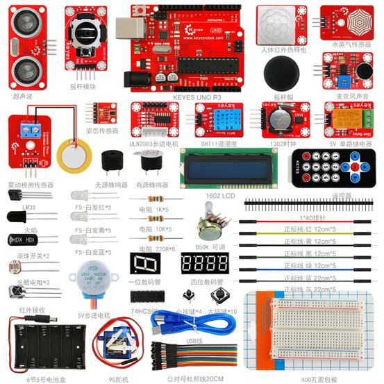

# 产品介绍

Keyes
超级版学习套件包含我们学习Arduino 单片机常用到的传感器模块、元器件和Arduino控制板。同时我们还会根据这些元器件和传感器模块，提供一些基Arduino控制板的学习课程，课程包含了接线方法、测试代码、实验结果等信息，它让你对这些元器件、传感器模块和Arduino控制板有个初步的了解。

# 清单

| 编码 | 名称         | 规格型号                                         | 数量 | 图片                                            |
| ---- | ------------ | ------------------------------------------------ | ---- | ----------------------------------------------- |
| 1    | 遥控器       | JMP-1 17键86*40*6.5MM 黑色                       | 1    | 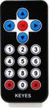 |
| 2    | keyes传感器  | keyes 人体红外热释电传感器                       | 1    |  |
| 3    | keyes传感器  | keyes 1302时钟传感器                             | 1    |  |
| 4    | keyes传感器  | keyes 超声波传感器                               | 1    |  |
| 5    | keyes传感器  | keyes 摇杆模块传感器(焊盘孔) 红色 环保           | 1    | 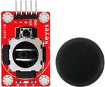 |
| 6    | keyes模块    | keyes 5V 单路继电器模块(焊盘孔) 红色 环保        | 1    | 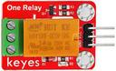 |
| 7    | keyes传感器  | Keyes Steam Seneor 水滴水蒸气传感器              | 1    | 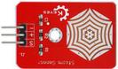 |
| 8    | keyes传感器  | keyes 麦克风声音传感器(焊盘孔) 红色 环保         | 1    | 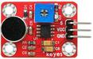 |
| 9    | keyes传感器  | keyes DHT11温湿度传感器(焊盘孔) 红色 环保        | 1    | 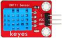 |
| 10   | keyes驱动板  | Keyes ULN2003步进电机驱动板（焊盘孔） 红色 环保  | 1    | 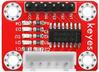 |
| 11   | keyes传感器  | keyes 9930 接近和非接触式手势检测RGB和姿态传感器 | 1    | 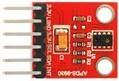 |
| 12   | keyes传感器  | Keyes Vibration Seneor 震动检测传感器            | 1    | 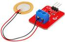 |
| 13   | 模块         | 5V步进电机                                       | 1    | 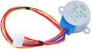 |
| 14   | 舵机         | SG90 9G 23*12.2*29mm 蓝色 辉盛(环保）            | 1    | 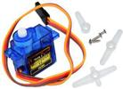 |
| 15   | LCD          | 1602 COB 5V 蓝屏                                 | 1    |  |
| 16   | 蜂鸣器       | 无源 12*8.5MM 5V 普通分体 2K                     | 1    | 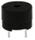 |
| 17   | 蜂鸣器       | 有源 12*9.5MM 5V 普通分体 2300Hz                 | 1    |  |
| 18   | 轻触按键     | 12*12*5MM 插件                                   | 10   | 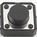 |
| 19   | 轻触按键     | 6*6*5MM 插件                                     | 4    |  |
| 20   | 传感器元件   | LM35DZ                                           | 1    |  |
| 21   | 传感器元件   | 5MM 光敏电阻                                     | 3    |  |
| 22   | 传感器元件   | 红外接收 5MM火焰                                 | 1    | 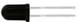 |
| 23   | 传感器元件   | 红外接收 VS1838B                                 | 1    | 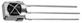 |
| 24   | 滚珠开关     | HDX-2801 两脚一样                                | 2    | 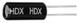 |
| 25   | LED          | F5-白发红-短                                     | 5    |  |
| 26   | LED          | F5-白发黄-短                                     | 5    |  |
| 27   | LED          | F5-白发蓝-短                                     | 5    |  |
| 28   | 电阻         | 碳膜色环 1/4W 1% 220R                            | 8    |  |
| 29   | 电阻         | 碳膜色环 1/4W 1% 1K                              | 5    |  |
| 30   | 电阻         | 碳膜色环 1/4W 1% 10K                             | 5    |  |
| 31   | USB线        | AM/BM 透明蓝 OD:5.0 L=50cm                       | 1    |  |
| 32   | 线材         | 正标线 红 12CM（方头）                           | 5    |  |
| 33   | 线材         | 正标线 黄 12CM（方头）                           | 5    |  |
| 34   | 线材         | 正标线 黑 12CM（方头）                           | 5    |  |
| 35   | 线材         | 正标线 绿 12CM（方头）                           | 5    |  |
| 36   | 线材         | 正标线 灰 22CM（方头）                           | 5    |  |
| 37   | 线材         | 正标线 蓝 22CM（方头）                           | 5    |  |
| 38   | 杜邦线       | 公对母20CM/40P/2.54/10股铜包铝 24号线BL          | 0.5  | 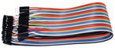 |
| 39   | 杜邦线       | 母对母20CM/40P/2.54/10股铜包铝 24号线BL          | 0.5  | 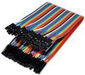 |
| 40   | 数码管       | 一位0.56英寸共阴红                               | 1    | 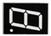 |
| 41   | 数码管       | 四位0.36英寸共阴红                               | 1    |  |
| 42   | 可调电位器   | 16MM 单联 B50K                                   | 1    | 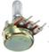 |
| 43   | IC           | 74HC595 DIP                                      | 1    | 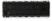 |
| 44   | 电池盒+插杆  | 6节5号带线15CM露线 带DC插杆                      | 1    |  |
| 45   | 面包板       | ZY-60 400孔白色（纸卡包装）                      | 1    | 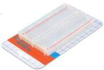 |
| 46   | 排针         | 1*40P 黑色 2.54 针长3.0等边                      | 1    |  |
| 47   | 电阻卡       | 100*70MM                                         | 1    | 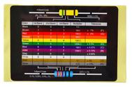 |
| 48   | KE0082开发板 | Keyes UNO R3 开发板 for arduino 红色 环保        | 1    | 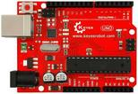 |
| 48   | KE0083开发板 | Keyes 2560 R3 开发板 for arduino 红色 环保       | 1    | 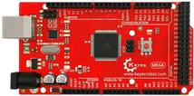 |